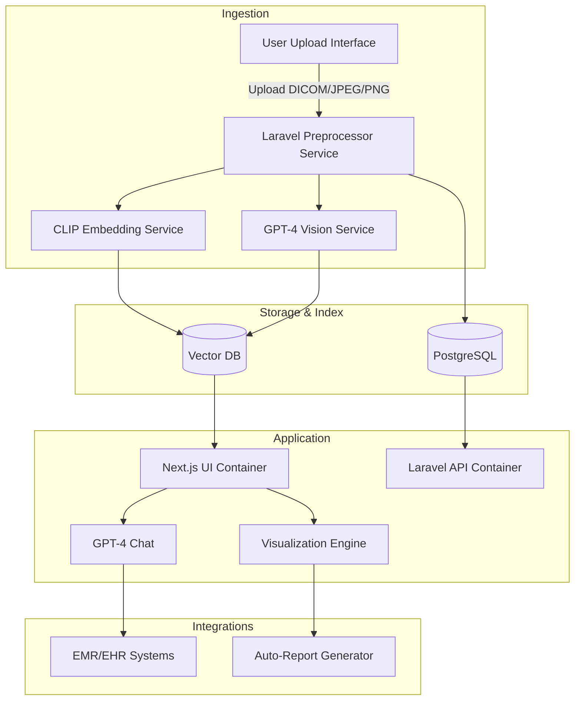

# OphthaAI

OphthaAI is a containerized web application for ophthalmology image analysis.

## Architecture



## Development

1. Copy `.env.example` to `.env` and adjust credentials.
2. Build and start containers:

```bash
docker-compose up --build
```

The frontend will be available on `http://localhost:3000` and backend on `http://localhost:8000`.
